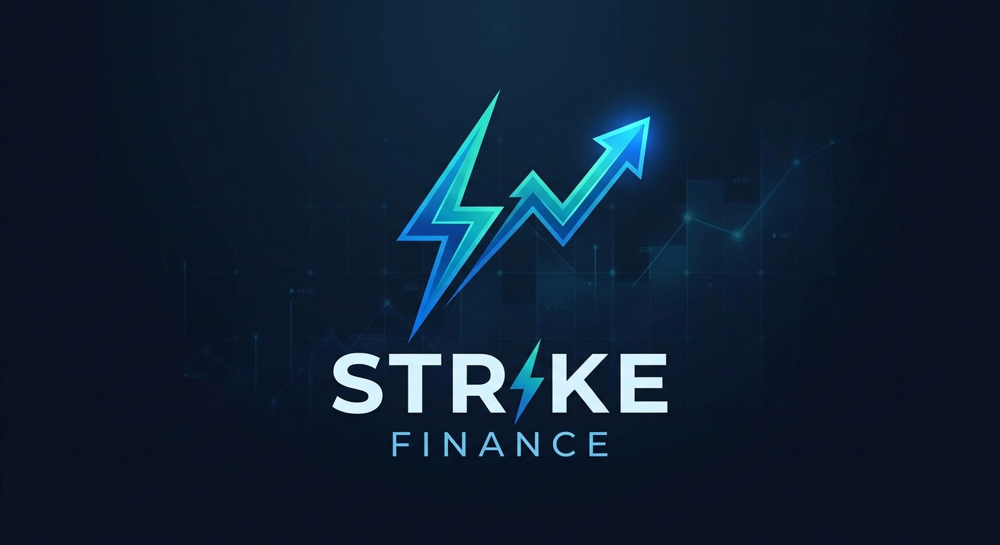

# 📈 Finance Strike! – Dashboard d'analyse boursière

**Finance Strike** est une application interactive développée avec **Python** et **Streamlit** pour l'analyse et la prévision de données boursières.

L'application permet d'analyser **7 actions américaines** :

**AAPL · TSLA · AMZN · META · NFLX · GOOG · MCD**

Elle propose différentes visualisations permettant d'explorer les séries temporelles, la volatilité, les corrélations ainsi que le couple risque/retour.

Un modèle de **Deep Learning LSTM (Long Short-Term Memory)** est également utilisé pour générer des prévisions à partir des données historiques.

---

##  Aperçu de l'application

<p align="center">
  
</p>
L'application Streamlit permet notamment de :

*  Explorer l'évolution des cours
*  Sélectionner une période d'analyse
*  Visualiser différentes caractéristiques des actions
*  Sélectionner une action
*  Analyser la volatilité et les performances
*  Étudier les corrélations entre les actifs
*  Comparer le risque et le retour
*  Générer des prévisions avec un modèle LSTM

---

#  Visualisations

Finance Strike propose plusieurs visualisations permettant d'explorer les données financières sous différents angles.

###  Analyse des séries temporelles


---

###  Analyse des données financières


---

###  Analyse de la volatilité


---

###  Corrélation entre les actions


---

###  Analyse risque / retour


---

###  Analyse complémentaire


---

#  Prévision avec LSTM

Finance Strike utilise un modèle **LSTM (Long Short-Term Memory)** pour effectuer des prévisions sur les séries temporelles financières.

Le LSTM est un réseau neuronal récurrent conçu pour traiter des données séquentielles et apprendre des dépendances temporelles.

###  Pipeline de prévision


Le processus de prévision suit les principales étapes suivantes :

```text
Données historiques
        │
        ▼
Nettoyage et préparation
        │
        ▼
Normalisation
        │
        ▼
Création des séquences temporelles
        │
        ▼
Modèle LSTM
        │
        ▼
Entraînement
        │
        ▼
Prévisions
        │
        ▼
Visualisation
```

>  Les prévisions produites par le modèle sont destinées à l'analyse et à la démonstration technique. Elles ne constituent pas des recommandations financières.

---

#  Modèle de Machine Learning

## LSTM — Long Short-Term Memory

Le modèle LSTM est utilisé pour traiter les données financières sous forme de séries temporelles.

Les données historiques sont transformées en séquences avant d'être utilisées pour entraîner le réseau neuronal.

Le modèle apprend ainsi des relations temporelles entre les observations passées afin de produire des prévisions.

### Étapes principales

```text
Historique des prix
        ↓
Prétraitement
        ↓
Normalisation
        ↓
Création des séquences
        ↓
Entraînement du LSTM
        ↓
Prédiction
        ↓
Dénormalisation
        ↓
Visualisation
```

---

#  Architecture du projet

```text
finance-strike/

├── app.py                     # Application Streamlit
├── run_ngrok.py               # Lancement + tunnel ngrok
├── requirements.txt           # Dépendances Python
├── .env.example               # Exemple de configuration
│
├── .streamlit/
│   └── config.toml            # Configuration Streamlit
│
├── assets/                    # Images du projet
│   ├── Image 1.png
│   ├── Image 2.png
│   ├── Image 3.png
│   ├── Image 4.png
│   ├── Image 5.png
│   ├── Image 6.png
│   └── Image 7.png
│
├── data/
│   └── stocks.csv             # Données financières
│
├── outputs/                   # Résultats des explorations
│
├── scripts/
│   ├── __init__.py
│   ├── download_data.py       # Téléchargement des données
│   └── explore_lstm.py        # Exploration du modèle LSTM
│
└── src/
    ├── config.py              # Constantes et hyperparamètres
    ├── data_loader.py         # Chargement et préparation des données
    ├── metrics.py             # Rendements, volatilité, corrélation...
    ├── charts.py              # Visualisations Plotly / Matplotlib
    │
    └── forecasting/
        ├── __init__.py        # Point d'entrée du forecasting
        └── lstm.py            # Modèle LSTM
```

---

#  Pipeline de données

```text
Yahoo Finance
      │
      ▼
Collecte des données
      │
      ▼
stocks.csv
      │
      ▼
Nettoyage & préparation
      │
      ▼
Analyse exploratoire
      │
      ├──────────────────┐
      ▼                  ▼
Visualisations          LSTM
      │                  │
      │                  ▼
      │              Prévisions
      │                  │
      └─────────┬────────┘
                ▼
        Dashboard Streamlit
```

---

#  Fonctionnalités

*  Téléchargement des données financières via `yfinance`
*  Analyse de 7 actions américaines
*  Filtrage des données par période
*  Analyse des séries temporelles
*  Analyse de la volatilité
*  Analyse des corrélations
*  Analyse risque / retour
*  Visualisations interactives avec Plotly
*  Visualisations avec Matplotlib
*  Prévisions avec un modèle LSTM
*  Interface interactive avec Streamlit
*  Exploration du modèle LSTM
*  Possibilité d'exposer l'application via ngrok

---

#  Technologies utilisées

| Technologie            | Utilisation                          |
| ---------------------- | ------------------------------------ |
| **Python**             | Développement de l'application       |
| **Pandas**             | Manipulation des données             |
| **NumPy**              | Calcul numérique                     |
| **yfinance**           | Récupération des données boursières  |
| **TensorFlow / Keras** | Modèle LSTM                          |
| **Scikit-learn**       | Prétraitement et normalisation       |
| **Plotly**             | Visualisations interactives          |
| **Matplotlib**         | Visualisations                       |
| **Streamlit**          | Interface web interactive            |
| **Git / GitHub**       | Versionnement                        |
| **ngrok**              | Exposition publique de l'application |

---

## Lancer l'application

```bash
streamlit run app.py
```

L'application sera ensuite accessible depuis l'adresse locale fournie par Streamlit.

---

#  Exploration du modèle LSTM

Pour lancer l'exploration du modèle sur une action donnée :

```bash
python -m scripts.explore_lstm --ticker AAPL
```

Les graphiques générés sont enregistrés dans :

```text
outputs/
```

---

#  Exposition publique avec ngrok

L'application peut également être exposée publiquement, notamment dans un environnement Google Colab.

Configurer le token :

```bash
export NGROK_AUTHTOKEN=votre_token
```

Puis lancer :

```bash
python run_ngrok.py
```

>  Ne jamais publier son véritable `NGROK_AUTHTOKEN` dans le dépôt GitHub.

---

#  Personnalisation

Les principaux paramètres du projet peuvent être modifiés dans :

```text
src/config.py
```

Il est notamment possible de modifier :

* les tickers analysés ;
* la profondeur de l'historique ;
* le nombre de périodes de prévision ;
* les hyperparamètres du modèle LSTM ;
* les paramètres utilisés pour les visualisations.

---

# 📁 Données

Les données financières sont récupérées via **Yahoo Finance** à l'aide de `yfinance`.

Le fichier généré est :

```text
data/stocks.csv
```

Les données historiques sont ensuite utilisées pour l'analyse, les visualisations et la préparation des séries temporelles destinées au modèle LSTM.

---

#  Améliorations futures

Quelques pistes d'évolution du projet :

*  Ajouter davantage d'indicateurs techniques
*  Tester différentes architectures LSTM
*  Comparer plusieurs horizons de prévision
*  Améliorer l'évaluation des performances du modèle
*  Automatiser la mise à jour des données
*  Ajouter une base de données pour historiser les données
*  Déployer l'application dans le Cloud
*  Ajouter du monitoring du modèle
*  Mettre en place une pipeline Data Engineering automatisée

---

# 👨‍💻 Auteur

**Khalid Ouro-Adoyi**

**Data Engineer | Data Analytics Engineer**

### Compétences

`Python` · `SQL` · `Pandas` · `Machine Learning` · `Deep Learning` · `LSTM` · `Streamlit` · `GCP` · `dbt` · `Snowflake` · `Power BI`· `Databricks`

